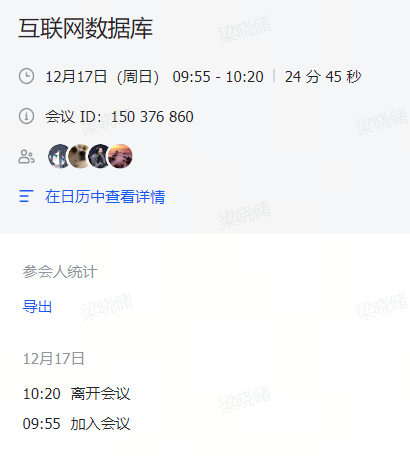
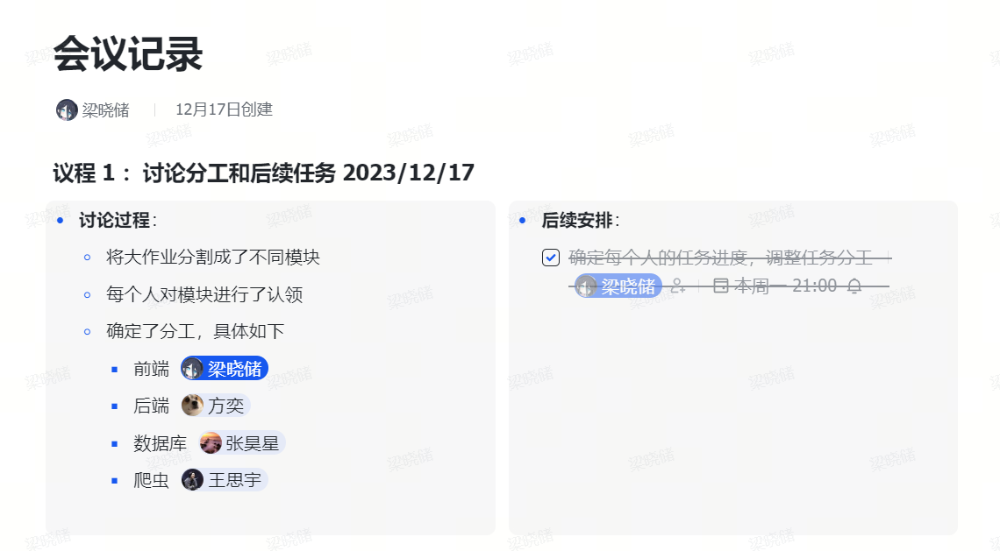

# 实现文档

## 前期规划





在项目实现之前进行了一次会议讨论，会议确认了网站是由`vue`和`yii2`组成前后端分离的形式，降低了部分组员的学习成本

同时由组长将整个项目的实现进行模块化拆分，为每位组员分配任务


## 任务分工

### 2110951 梁晓储

- 全权负责Vue前端代码
- 前后端连接的实现
- 后端api控制器的框架编写
- 部分后端api函数的调整


### 2112106 方奕

- Yii2后端的构建
- 后端与Mysql数据库的连接
- 独自完成Yii2中models的编写，实现表项的传入
- 独自数据库在后端的CRUD功能
- 完成了大部分后端api函数
- 后端主页的设计


### 2113419 张昊星

- 独自完成数据库的设计与构建
- 为每个表项进行主键设置与外键连接
- 实现表与表之间联动的触发器
- 数据验证与处理
- 部分后端api函数的调整


### 2112414 王思宇

- 完成了爬虫模块的编写，为数据库提供了大量数据
- 负责网页数据内容的查找
- 完成了每个文档的大部分内容
- 负责PPT制作


## 主要代码展示

### 前端部分

前端代码最主要的部分就是与后端交互并且将后端传入的数据写入网页中

本项目使用的是axios，它能够实现异步请求管理以及支持并发请求。以其中一个函数为例：

```javascript
getUrl() {
    const id = this.$route.params.id
    axios
        .post('http://localhost:8080/api/getarticle?id=' + id)
        .then((response) => {
            this.title = response.data.Title
            this.content = response.data.Content
            this.articleTime = response.data.PublicationDate
            console.log(this.title)
        })
        .catch((error) => {
            console.error('请求数据失败', error)
        })
},
```

这个函数首先获取当前路由，并且将其作为参数通过`post`请求发送给后端提供的api，后端的api接收到这个请求后就会回应给前端一个response，经过后端的处理，这个response会以一个json的形式供前端读取。将json中一些量赋值给前端页面中定义的变量，就完成了前后端的数据交互。


### 后端部分

为了实现与前端的交互，后端首先要解除 cors 令牌，因为yii2框架有一个机制，每个请求都会先传入这个令牌再进行处理，不解除的话前端发送过来的跨域请求都会被yii2拒绝

```php
// #config/web.php
'components' => [
    'request' => [
        'enableCsrfValidation' => false 
    ],
]

'response' => [
    'charset' => 'UTF-8',
    'on beforeSend' => function ($event) {
        $response = $event->sender;
        $response->headers->set('Access-Control-Allow-Origin', '*');//设置跨域请求
        $response->headers->set('Access-Control-Allow-Methods', 'GET, POST, PUT, DELETE, OPTIONS');
        $response->headers->set('Access-Control-Allow-Headers', 'Origin, X-Requested-With, Content-Type, Accept');
    },
],
```

开放了跨域请求后，还需要设置对前端获取数据提供api接口

```php
// #config/web.php
'urlManager' => [
    'enablePrettyUrl' => true,
    'showScriptName' => false,
    'rules' => [
        'api/login' => 'api/login',
        'api/signup' => 'api/signup',
        'api/adminlogin' => 'api/adminlogin',
        'api/getarticle' => 'api/getarticle',
        'api/getvideo' => 'api/getvideo',
        'api/getvideocomment' => 'api/getvideocomment',
        'api/getarticlecomment' => 'api/getarticlecomment',
        'api/getclick' => 'api/getclick',
        'api/addvideocomment' => 'api/addvideocomment',
        'api/addarticlecomment' => 'api/addarticlecomment',
        'api/addclick' => 'api/addclick',
        'api/getpersonalinfo' => 'api/getpersonalinfo',
        'api/addwebviews' => 'api/addwebviews',
        'api/getvideopagecount' => 'api/getvideopagecount',
        'api/getarticlepagecount' => 'api/getarticlepagecount',
        'api/checkwebviews' => 'api/checkwebviews',
        'api/getvideolikes' => 'api/getvideolikes',
        'api/getarticlelikes' => 'api/getarticlelikes',
        'api/addvideolikes' => 'api/addvideolikes',
        'api/addarticlelikes' => 'api/addarticlelikes',
    ],
],
```

需要在urlManager的rules中配置所需要的api接口，其中左侧的`api/##`代表着前端访问的路由为`/api/##`

，右侧的`api/##`代表着Yii2会去ApiController.php中调用`action##`函数来处理本次请求。

以前端获取视频为例，本次请求对应着`'api/getvideo' => 'api/getvideo'`语句，前端会使用`axios`向`http://localhost:8080/api/getvideo`发送请求，随后Yii2后端会调用`actionGetvideo()`来处理数据并且将处理好的数据传递给前端

```php
// #controllers/ApiController.php
namespace app\controllers;
use app\models\Videos;

public function actionGetvideo()
{
    \Yii::$app->response->format = \yii\web\Response::FORMAT_JSON;

    // 获取页数
    $page = \Yii::$app->request->get('page');
    $intpage = (int)$page;
    $id = \Yii::$app->request->get('id');

    if ($id !== null) {
        // 如果有 id 参数，则查询指定 VideoID 的视频信息
        $videos = Videos::find()->select(['VideoID', 'Title', 'Description', 'PictureURL', 'UploadDate', 'VideoURL'])->where(['VideoID' => $id])->one();
    } else {
        // 否则按照原来的逻辑查询分页数据
        $videos = Videos::find()->select(['VideoID', 'Title', 'Description', 'PictureURL', 'UploadDate', 'VideoURL'])->offset(18 * ($intpage - 1))->limit(18)->all();
    }

    // 格式化为 JSON 并返回
    return $videos;
}
```


### 爬虫部分

本组选取的是央视视频网对视频进行抓取，中国新闻网对文章进行抓取。以最复杂的视频抓取为例

首先我们获取到了样式视频网对搜索请求的api，其中page参数为页数，qtext_str参数为‘核污染’关键字

```
"https://search.cctv.com/ifsearch.php?page={page}&qtext=%E6%A0%B8%E6%B1%A1%E6%9F%93&sort=relevance&pageSize=20&type=web&vtime=-1&datepid=1&channel=&pageflag=1&qtext_str=%E6%A0%B8%E6%B1%A1%E6%9F%93"
```

随后使用requests和BeautifulSoup对返回内容进行获取，再使用json.loads对网页内容格式化

```python
response = requests.get(url)
soup = BeautifulSoup(response.text, "html.parser")
json1 = json.loads(soup.text)
```

随后到了数据处理部分

```python
items = json1["list"]
for item in items:
    item["all_title"] = re.sub(r"^\[[^][]*\]", "", item["all_title"])
    a = {
        "id": item["id"],
        "title": item["channel"],
        "content": item["all_title"],
        "updatetime": item["uploadtime"],
        "picurl": item["imglink"],
    }
    parsed_url = urllib.parse.urlparse(item["imglink"])
    path = parsed_url.path
    # 获取最后一个斜杠之前的子串
    last_slash = path.rfind("/") + 1
    # 获取最后一个斜杠之后的子串
    last_part = path[last_slash:]
    videoId = last_part.split("-")[0]
```

到了最重要的部分，我们后续发现搜索请求的api中并没有视频的播放源链接，不过经过组员对网页内容的分析和请求爬取，找到了视频源请求的api

`https://vdn.apps.cntv.cn/api/getHttpVideoInfo.do?pid=`

再次根据这个url进行数据抓取就获取到了所有视频信息

```python
url = "https://vdn.apps.cntv.cn/api/getHttpVideoInfo.do?pid=" + videoId
response1 = requests.get(url)
json2 = json.loads(response1.text)
b = json2["video"]["chapters4"][0]["url"]
a["videourl"] = b
```


获取到视频信息后，还需要将信息写入数据库中，我们使用了pymysql库进行操作

```python
# 创建数据库连接
connection = pymysql.connect(
    host="localhost",
    user="root",
    password="root",
    db="internetdatabasedevelopment",
)

# 创建游标对象
cursor = connection.cursor()

for movie in movieList:
    query = f"INSERT INTO videos (VideoID, Title, Description, PictureURL, VideoURL, UploadDate) VALUES ('{movie['id']}', '{movie['title']}', '{movie['content']}', '{movie['picurl']}', '{movie['videourl']}','{movie['updatetime']}')"
    cursor.execute(query)

# 事务提交
connection.commit()

#关闭连接
connection.close()
```

首先进行Mysql的连接和数据库的选择，然后创建游标对象，再根据这个游标对象完成查询语句，最后提交到数据库中并关闭连接


