# 用户手册

项目名称：`晴空蔚海——前后端分离的核污染宣传网站`

### 一、 项目概述

本网站以“核污染废水排海”为主题，向用户介绍了核污染废水排海事件的历程和核污染废水排海的危害，用户可以通过本网站的文章和视频了解更多有关核污染废水的相关内容并进行观点的发表。

### 二、使用说明

#### 用户注册

用户通过浏览器访问网站地址时，首先进入注册界面，用户输入用户名、密码、确认密码进行账号注册，密码至少为8位数，并且要包含大小写字母数字。每位用户必须有账号才能登录。注册完成后会显示“注册成功”的提示信息。如果密码和确认密码不一致，会显示相应的报错信息。如果用户已经拥有账号，可以点击下面的登录按钮去进行登录。

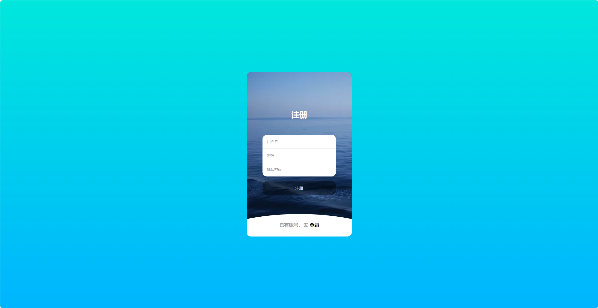

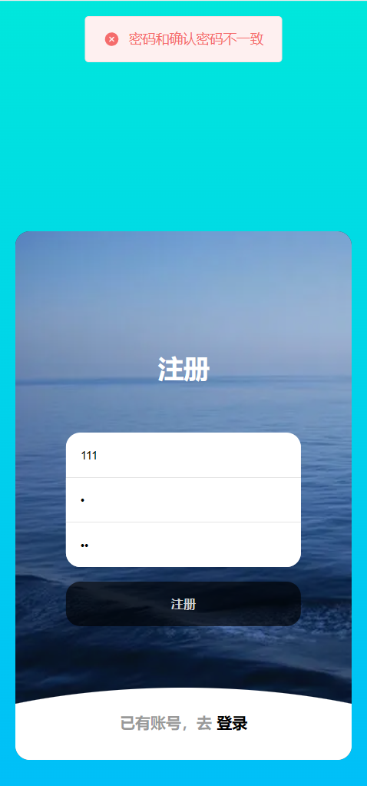

#### 用户登录

用户输入注册成功的用户名和密码进行登录，若登录成功会显示“登录成功”的提示信息。如果用户的用户名和密码不匹配时，会显示“密码错误”的报错信息。如果用户还没有账号，可以点击上方的注册按钮去注册账号。

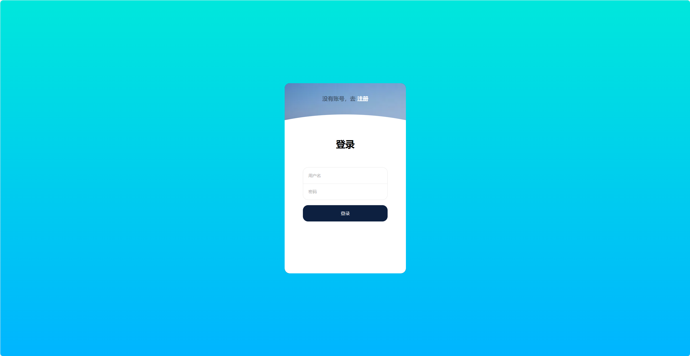

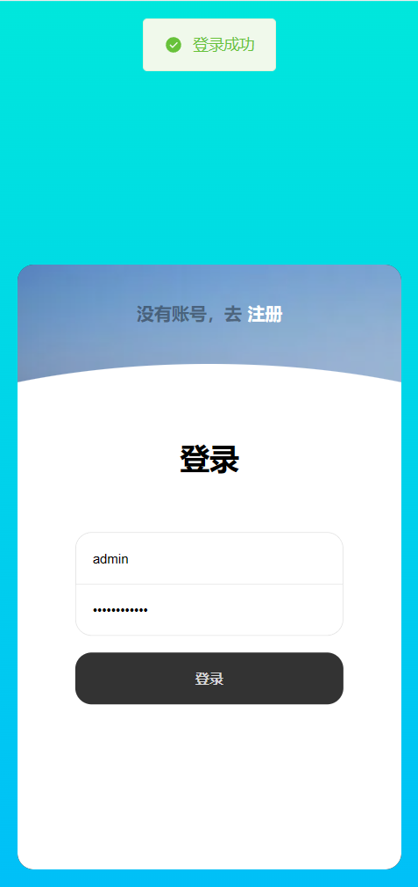

#### 首页介绍

用户登录成功后，自动进入网站的首页。首页的按钮位于整体页面的左上方。也可以通过点击“首页”按钮重新进入首页。在首页，首先可以看到日本危害海洋环境的始末，是通过图片加文字的形式进行循环播放。往下看，是一个动画模拟日本排放的核污染废水进入海洋后流动的轨迹：宏观显示地球，随着天数的增加，核污染废水的污染海洋面积会逐渐扩大（红色区域代表受到污染的地区）。继续往下是一个视频，介绍核污染废水排海的危害。用户可以通过首页的介绍初步对核污染废水排海的事件和危害有一定的了解。如果想要深入的了解，可以通过下面介绍的其他界面。

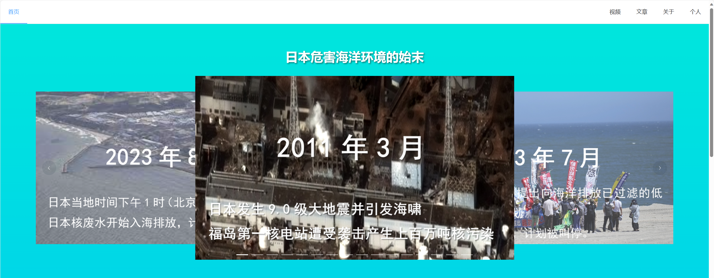

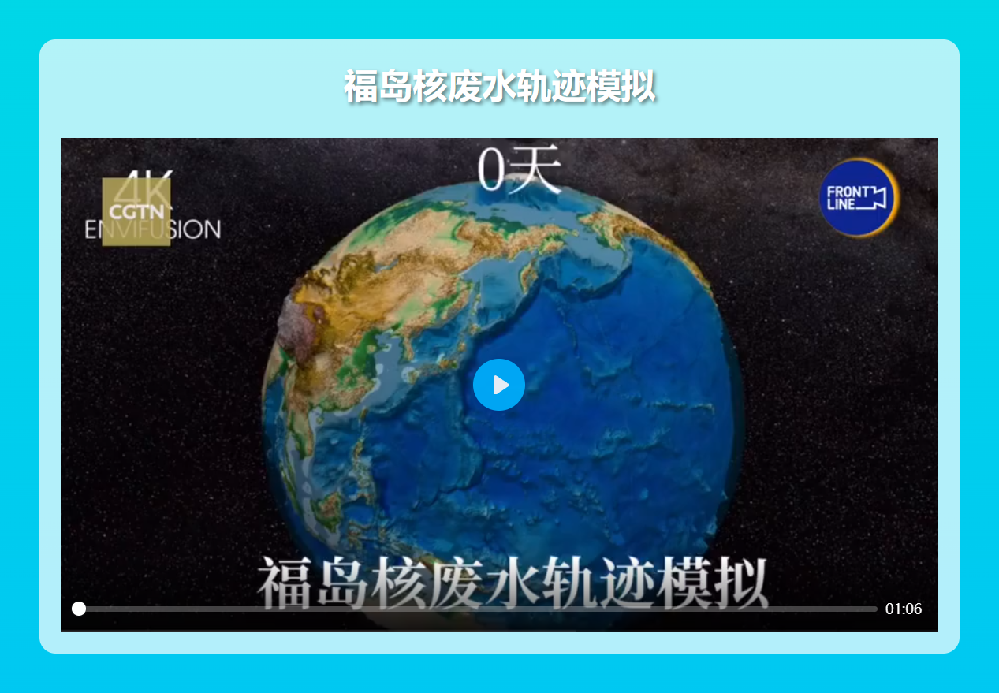

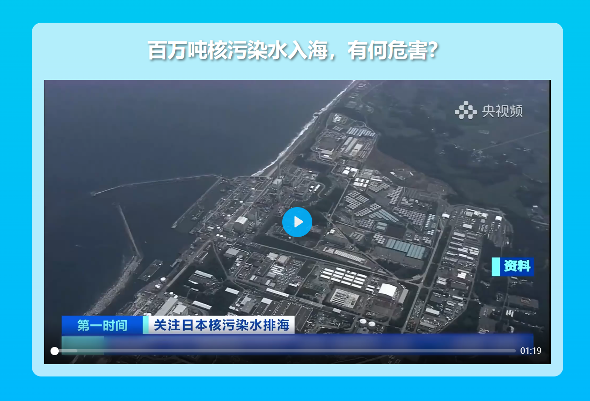

界面下方有流动的水波纹：通过模拟大海波浪，让用户可以联想到海洋保护，进而唤醒核污染防治的意识

#### 视频页面

点击页面右上方的“视频”按钮，进入视频页面。在该界面，用户可以看到许多有关核污染废水的新闻视频，本界面通过展示新闻视频的封面简要介绍视频的有关内容，用户可以选择自己感兴趣的视频进行点击视频封面。

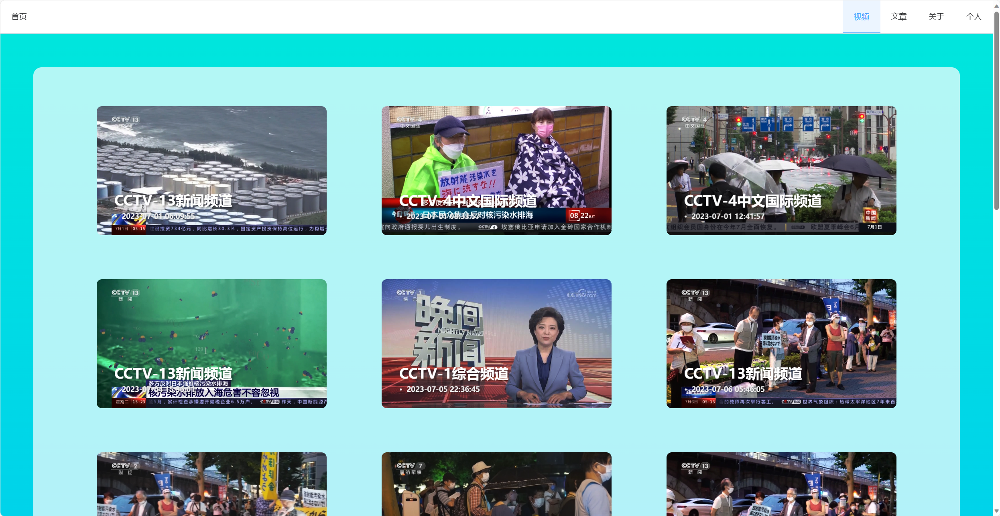

当有多页视频，在页面最下方有页面切换显示，可以跳转到不同的页。这个是根据视频总数实时更新的

点击某个视频封面之后，会跳转到视频的具体界面。此时，用户可以播放观看视频，视频下方有视频的标题简介。

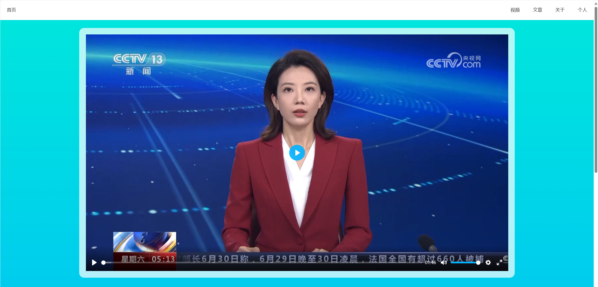

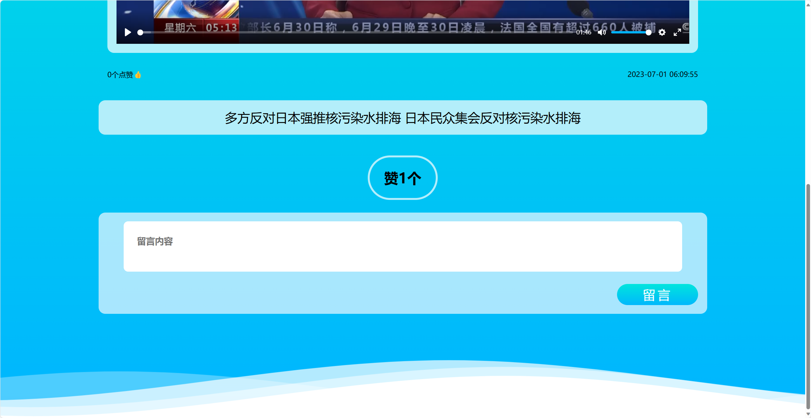

下面有一个“点赞”按钮，用户可以对视频进行点赞，然后会显示视频获得的赞的数量。“点赞”按钮是动态的，支持点赞一个、两个、三个。

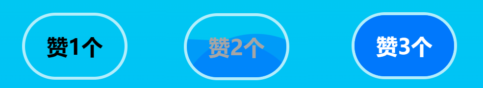

最下面还有评论区，用户可以进行留言发表自己对视频的见解。

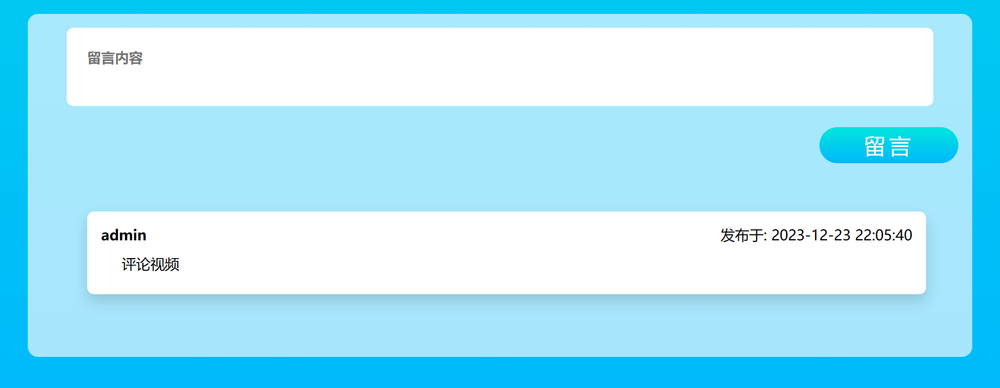

#### 文章页面

点击页面右上方的“文章”按钮，进入文章页面。

与视频页面类似，在该界面，用户可以看到许多有关核污染废水的新闻文章，本界面通过展示新闻文章的标题简要介绍文章的有关内容，用户可以选择自己感兴趣的文章进行点击。

点击之后，会跳转到文章的具体界面。此时，用户可以查看文章的具体内容，然后下面有一个“点赞”按钮，用户可以对文章进行点赞，然后会显示文章获得的赞的数量。

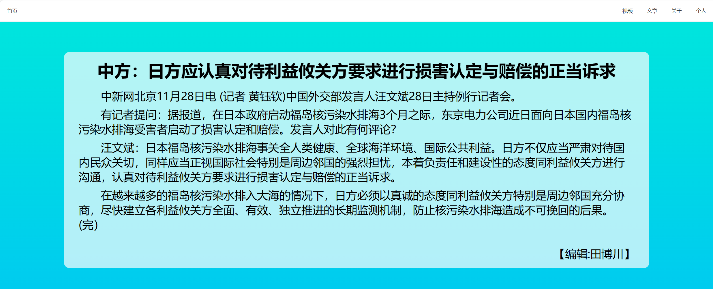

#### 关于页面

点击页面右上方的“关于”按钮，进入关于页面。本界面会显示网站被访问的次数，然后介绍建站的目的、网站的功能概括.

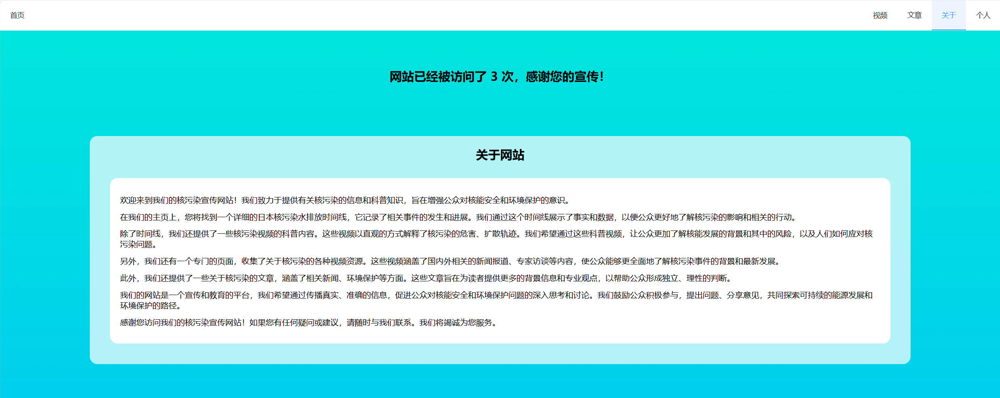

显示项目团队成员的信息，包括：项目分工、成员联系方式。点击“Contact me”按钮会显示联系方式，包括：电子邮箱、GitHub和微信账号。用户如果对网页有任何问题或者疑问，可以联系团队成员进行沟通。点击电子邮箱，会跳转到邮箱界面，用户就可以发送电子邮件。点击GitHub账号，会跳转到github网站。

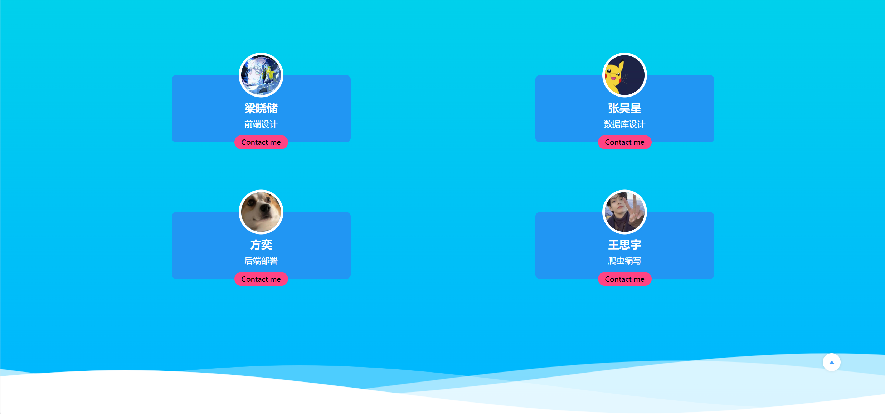

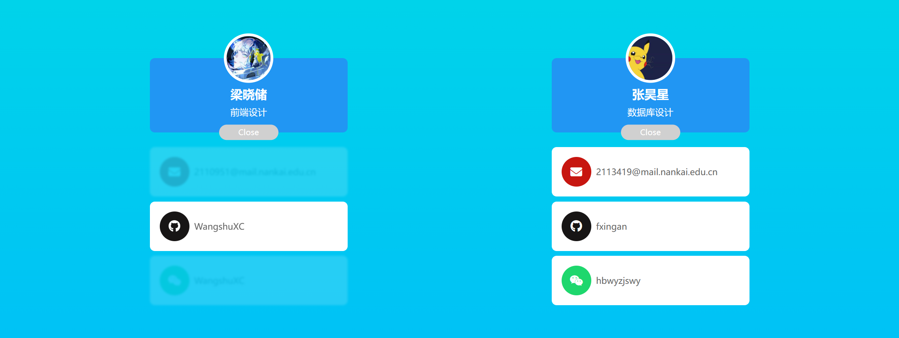

#### 个人页面

点击页面右上方的“个人”按钮，进入个人信息页面。显示用户的个人信息：主要包括用户的账号、取消登录、查看评论。有一个“退出登录”按钮，用户点击它可以退出网站的登录。

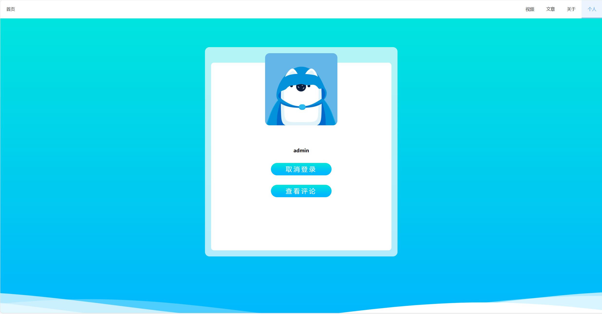

点击“查看评论”按钮，会在下面显示用户发表过的留言，包括留言的视频或文章的id、留言的内容和留言时间。此时“查看评论”按钮就会变为“隐藏评论”按钮。点击留言的视频或者文章的id，将会跳转到该留言对应的具体的视频或者文章下面查看当时的留言。

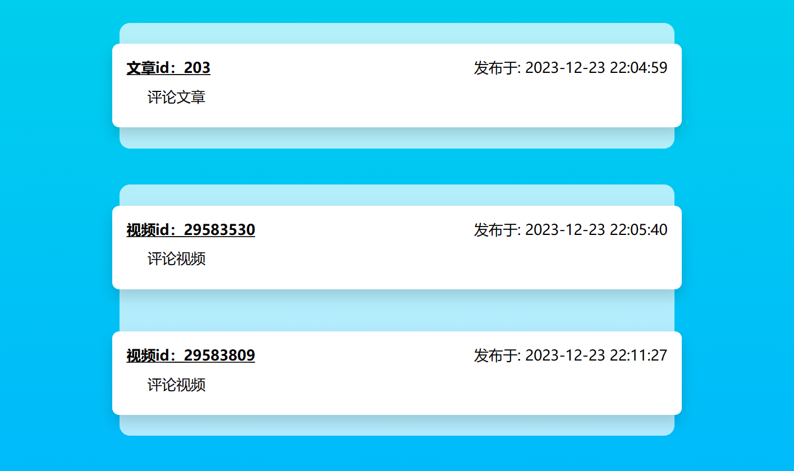

再次点击“隐藏评论”时，就会把上面显示的评论全部隐藏。

#### 错误界面

当用户访问的路由没有对应的页面时，会返回一个错误界面（404界面），错误界面主要是一个动画效果，显示文字“核污染产生的怪兽把这个界面吃掉了”提示用户该界面不存在。

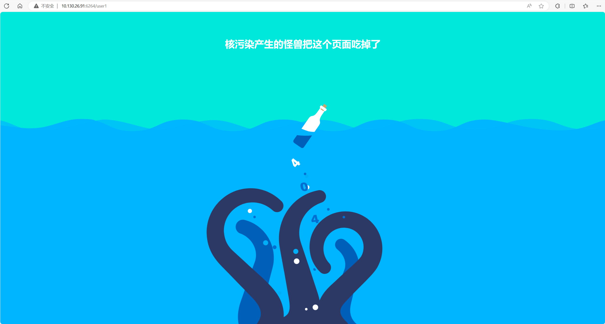

以上就是本网站的全部用户内容，感谢您对本网站的使用与支持！

