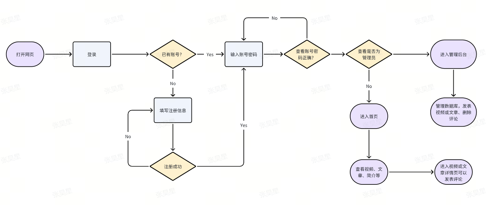
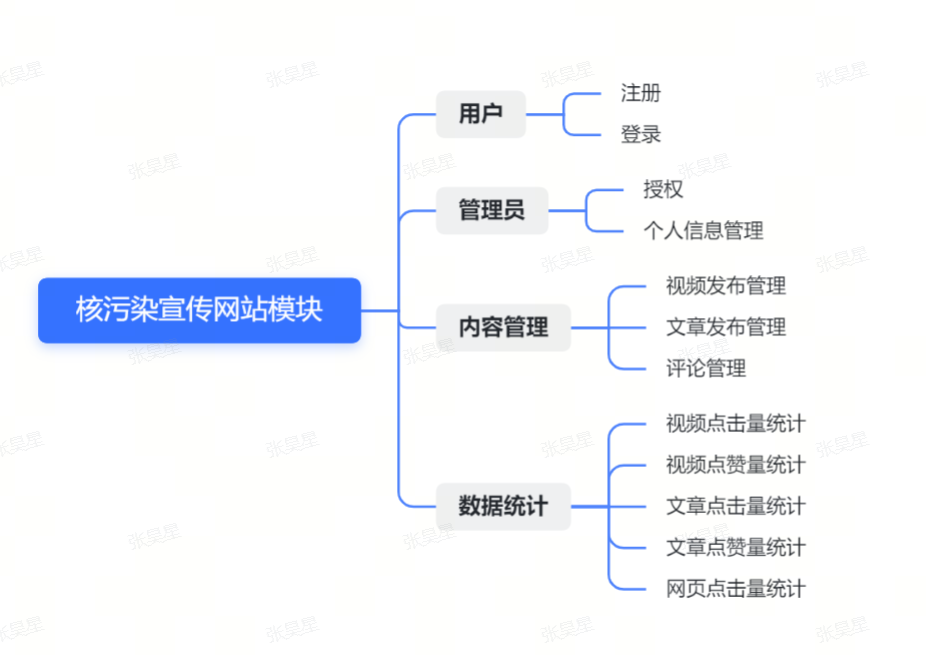

# 设计文档

## 项目概述

项目描述：创建一个核污染宣传视频与文章网站

## 数据库设计

### 概述

本数据库用于存储视频、文章、评论、用户与管理员信息等。

数据库结构被设计为支持以下功能：

- 用户注册与登录
- 管理员授权
- 管理员信息
- 视频和文章的发布与管理
- 评论功能
- 视频文章点击量统计
- 网页点击量统计

### 数据库字典

#### Users

- UserID：用户ID (主键)
- Username：用户名
- Password：用户密码

#### Videos

- VideoID：视频ID (主键)
- Title：视频标题
- Description：视频描述
- PictureURL：封面链接
- VideoURL：视频链接
- UploadDate：上传日期

#### Articles

- ArticleID：文章ID (主键)
- Title：文章标题
- Content：文章内容

#### Articlecomments

- CommentID：评论ID (主键)
- Username：评论用户名 (外键参考 Users 表)
- ArticleID：文章ID (外键参考 Articles 表)
- Comment：评论内容
- CommentDate：评论日期

#### Videocomments

- CommentID：评论ID (主键)
- Username：评论用户名 (外键参考 Users 表)
- VideoID：视频ID (外键参考 Videos 表)
- Comment：评论内容
- CommentDate：评论日期

#### Clicks

- ClickID：点击量ID (主键)
- ContentID：视频ID或者文章ID (外键参考 Videos 表和 Articles 表)
- ContentType：类型“视频”或“文章”
- ClickCount：点击量

#### Admins

- AdminID：管理员ID (主键)
- Username：管理员用户名 (外键参考 Users 表)

#### Personalinfo

- Name：管理员名字 (主键)
- Info：分工 
- AvatarURL：头像链接 
- Email：邮箱
- GitHubAccount：Github账号
- WeChatID：微信号

#### Webviews

- Views：网页点击量（主键）

#### Videolikes

- LikeID：点赞ID (主键)
- VideoID：视频ID (外键参考 Videos 表)
- Likes：点赞量

#### Articlelikes

- LikeID：点赞ID (主键)
- ArticleID：文章ID (外键参考 Articles 表)
- Likes：点赞量

## 数据流程图

## 模块图

